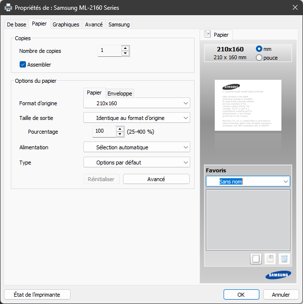

Création de PDF d'étiquette de prix 14 x 14 (193 x 143)

# GNU/Linux
## Installation
``` bash
python3 -m venv venv
source venv/bin/activate
pip install weasyprint
weasyprint --info
```

## Usage
``` basg
source venv/bin/activate
./GeneratePdf.bash
```

# Windows
## Installation
The Weasyprint executable is already in the current folder

## Usage
``` cmd
GeneratePdf.cmd
```



